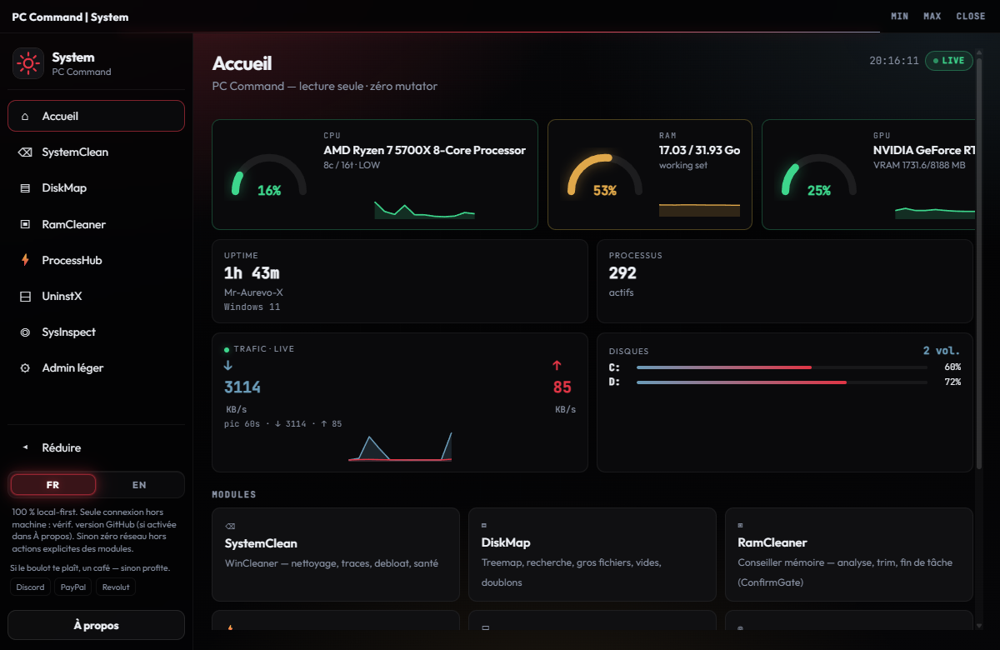
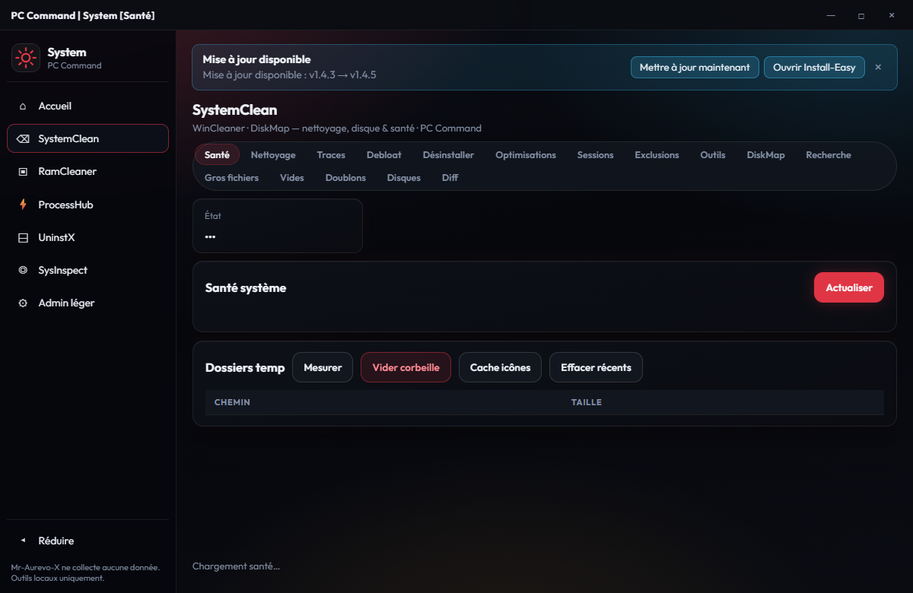

# Hub-Systeme — L'Atelier PC Command

Hub catégorie **Système** — Couche B + H7 native + flatten `host.py` / `backend/`.

## Aperçu

| Accueil | Module |
|---------|--------|
|  |  |

## Modules

| Module | Source fusionnée | ConfirmGate |
|--------|------------------|-------------|
| SystemClean | WinCleaner · DiskMap | empty_recycle_bin · rebuild_icon_cache · clear_recent_files · delete_large_file · delete_empty_folder · trash_dup_paths |
| RamCleaner | Lab/Ram Cleaner | kill_selected · trim_selected (`api.ramcleaner.*`) |
| ProcessHub | ProcessGuard · StartupX | kill_process · empty_working_set · service_action · set_task_enabled · create_at_logon |
| UninstX | UninstX | uninstall_app |
| SysInspect | SysInspect | — (lecture seule) |
| Admin léger | PowerPlan · PrintQueue · RestorePoint · UserSessions | set_plan · purge_printer_jobs · create_restore_point · logoff_session (+ nested `api.admin.*`) |

Dashboard = KPIs lecture seule (disque / RAM / process). Fallback « Fenêtre dédiée » via `suite_launch`.

## Lancer

```bat
Lancer.cmd
```

Nécessite Python + `pywebview` + `psutil` (Admin hérité du launcher PC Command ; UAC aussi dans `main()`).

## Structure

```text
host.py                 # entry + UAC + webview
backend/
  bridge.py             # Api + namespaces (systemclean, processhub, …)
  security.py           # ConfirmGate (SecurityHelpers)
  window_chrome.py      # vendored HostHelpers
  suite_launch.py       # vendored HostHelpers
  tools/                # logique métier (wincleaner, diskmap, processguard, …)
ui/index.html           # shell + sidebar
ui/app.js               # navigation + lazy modules + titres Atelier
ui/_hub_util.js         # helpers JS natifs (pas d’iframe)
ui/dashboard.js         # home KPIs
ui/modules/*.js         # UIs Couche B / H7
```

Titres HWND : `PC Command | System` / `[Module|Segment]` (ex. `[RamCleaner]`).

`_source_apps/` = clones référence des anciennes mini-apps (non shippés). SoT runtime = `backend/tools/`.

## Soutien

Coups de pouce volontaires (PC Command reste gratuit) :

[](https://www.paypal.com/paypalme/aurevo1)
[](https://revolut.me/mr_aurevo_x)
